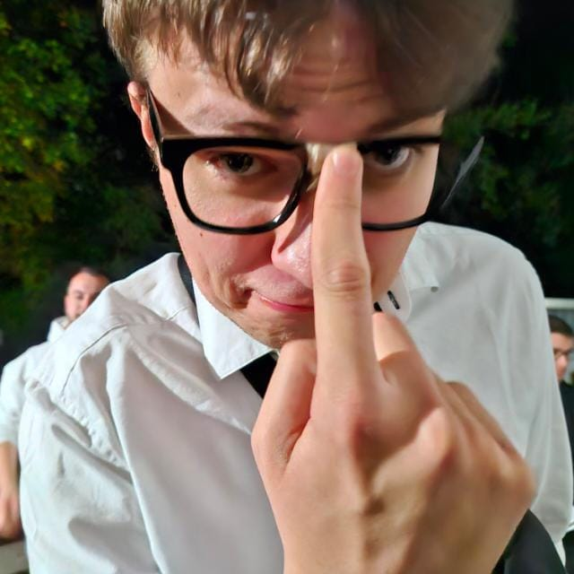

---
hide:
  - navigation
  - toc
password: Westfalenpark
---

# 🧩 Rätsel 3

## Verdammt, warum bist du so gut?!

Na gut… eine letzte Herausforderung wartet auf dich.  
Und einfacher wird es ganz sicher **nicht**!

---

### 🎯 Aufgabe: *Vier Bilder – Ein Wort*

Die Antwort, die du suchst, besteht aus **fünf Buchstaben**.  
Schau dir die Bilder gut an – was haben sie gemeinsam?

> 💡 **Tipp:** Denk quer. Manchmal ist das Offensichtliche genau das Richtige.

---

**Viel Erfolg, du bist fast am Ziel! 🚀**
### **wenn du dir sicher bist kannst du hier zum nächsten Rätsel:**  

